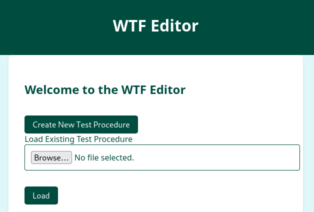
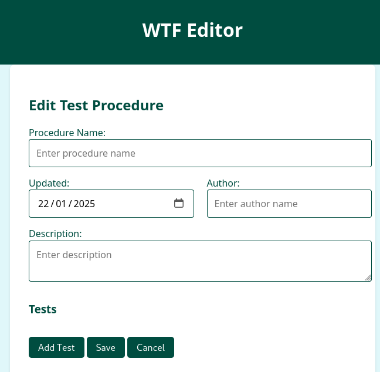
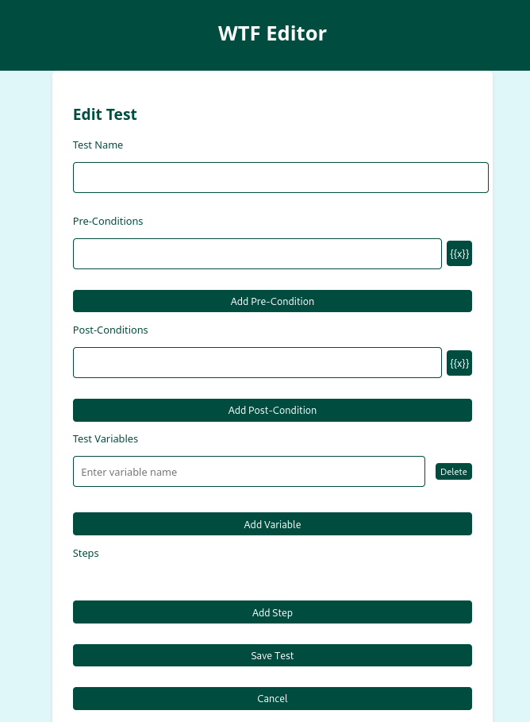
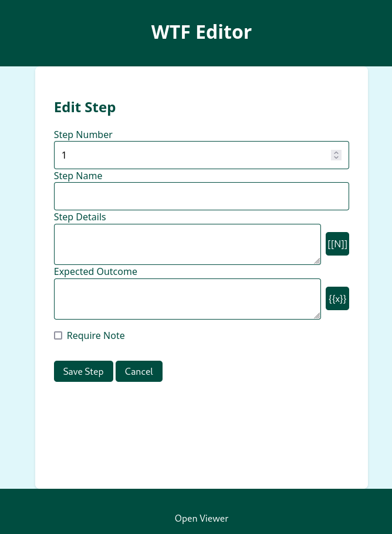
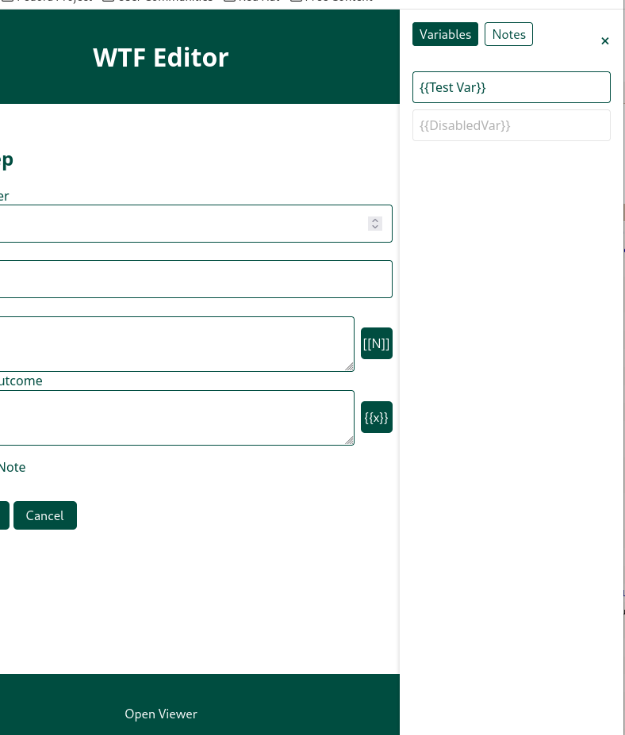
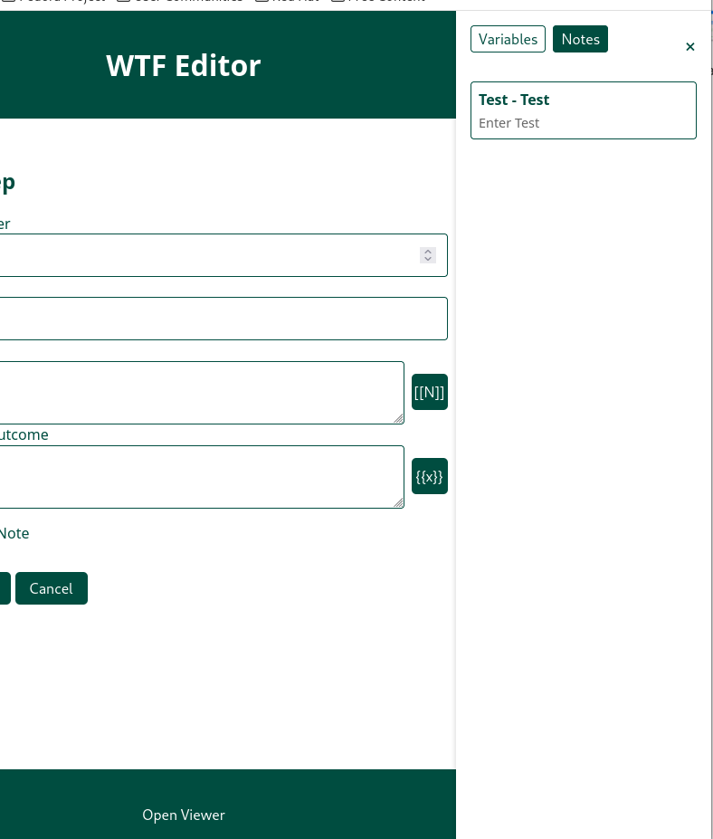

# Web Test Framework

A browser-based tool for executing and documenting manual test procedures. This framework transforms JSON-based test scripts into interactive, step-by-step test sessions with built-in documentation features.

## Features

- Load and customise test procedures
- Select specific tests to run from a procedure
- Variable substitution in test steps
- Output data collection during tests
- Reference previously collected data in later steps
- Local note storage with sidebar access
- Detailed test statistics and reporting
- Print-ready report generation
- Offline-first design - no internet connection required
- Create and edit test procedures through a GUI interface
- Add, edit, and delete tests
- Manage test steps with descriptions and expected outcomes
- Define variables for use across tests
- Set up note collection requirements
- Reference previously collected notes in later steps
- Reorder steps by changing step numbers
- Save and load test procedures as JSON files

## Installation

1. Download the repository
2. Maintain the following directory structure:
```
web-test-framework/
├── src/
│   ├── css/
│   │   └── main.css
│   ├── js/
│   │   └── main.js
│   └── index.html
```
3. Open `index.html` in a browser.

## Usage

### Test Procedures
Test procedures are JSON files following the schema provided in `src/examples/schema.json`. Each procedure contains one or more tests, and each test contains steps that can:
- Require variable input
- Prompt for note collection
- Reference previously collected notes
- Record pass/fail status and comments

### Variables
When a test includes variables (e.g., `{{username}}`), you'll be prompted to provide values before the test begins. These values are then substituted throughout the test.

### Notes
Notes can be:
- Required by specific steps
- Created manually at any time
- Referenced in later steps using `[[note]]` syntax
- Viewed in a collapsible sidebar
- Included in the final report

### Statistics
After completing tests, you'll see:
- Overall pass rate
- Individual test results
- Detailed step status
- All collected notes
- Printable report with signature line

### Test Editor
The editor allows creation and modification of test procedures:
1. Create new or load existing test procedure
2. Add tests with pre/post conditions and variables
3. Add steps to tests with:
   - Step number (for ordering)
   - Description and expected outcome
   - Note collection requirements
   - Variable substitution
   - References to previously collected notes
4. Save procedure as JSON file

## Privacy & Data Storage
- All data stays on your local machine
- No internet connection required
- Notes stored in browser's localStorage
- No data transmitted externally

## Browser Compatibility
Currently tested only in Firefox 133.0.3 (64-bit)

## Screenshots

### Initial Load Screen


### Test Selection


### Test Variables


### Test Execution


### Required Notes
Required notes are a way of passing the output from one test step into another test step.
In this example, we have to collect the transaction number in order to search for the 
transaction later when testing if log entries can be edited.


### Statistics View
A simple pass/fail rate is shown by default, but the test report can be examined in
more detail by selecting **Show Details**. A report can also be printed, which has space
for the tester to sign the tests, by pressing **Print Report**. The printed report contains
the detailed test information, and a copy of all notes in the notes sidebar (if any).


### Notes
Notes can be automatically collected as part of a test step, or added manually by the user.
Notes are stored in the browser's local storage, so can be used to persist information
between sessions. Both automatic and manual notes appear in the sidebar, which can be
opened by clicking the **Notes** button on the right of the screen.


### Editor Screenshots

#### Editor Landing


#### Procedure Editor


#### Test Editor


#### Step Editor


#### Variable Insertion


#### Note Reference


## License
GNU General Public License v3.0